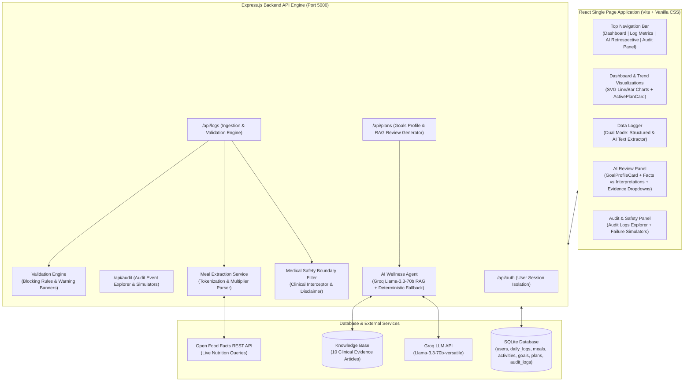

# 🩺 Longitudinal Health & Nutrition Review Agent

A full-stack, stateful AI-powered wellness application built to track daily health metrics, detect data anomalies, extract nutrition from natural language text via live REST APIs, perform evidence-backed RAG retrospectives, and manage versioned health goals (`v1` → `v2`) with human-in-the-loop approval panels.

---

## 📐 Architecture Overview



---

## 🌟 Key Version Features (V1 – V6)

* **V1: Skeleton, Auth Gateway & SQLite Storage**: User signup/login with Date of Birth and Sex collection, salted SHA-256 hashing, and user-isolated database tables.
* **V2: Daily Metrics & Summaries**: Ingestion for weight, height, sleep, mood, energy, structured workouts, and meals. Server-side math averages for 7-day and 30-day periods.
* **V3: Data Integrity Engine & SVG Charts**:
  * 🛑 **Blocking Anomaly Rules**: Sleep < 3h & Energy ≥ 9 paradox; Active > 120m & Calories < 1000 kcal extreme deficit.
  * ⚠️ **Non-Blocking Warnings**: 24h weight jump (+3kg) and high calorie/weight loss contrast.
  * ℹ️ **Gap Scanner**: Past 7-day missing log detector.
  * 📊 **Pure SVG Visualizations**: Zero-dependency SVG Line Charts & Bar Charts with 7d/30d range toggling.
* **V4: Text Meal Extraction & User Correction Auditing**:
  * 📝 **AI Text Extractor**: Plain text parsing (*"Had 2 Rotis with Dal Makhani"*) via live Open Food Facts REST API with quantity multipliers (`2x Rotis`).
  * ✍️ **Interactive Override Grid**: Editable inputs for calories and macros before saving.
  * 📋 **Audit Event Logging**: SQLite records for `UserCorrection` and `AIUncertainty` events.
* **V5: AI Wellness Agent & Plan Versioning (`v1` → `v2`)**:
  * 🎯 **Active Goals Profile Card**: Supports **Multiple Target Physical Activities** (*Running, Walking, Cycling, Gym*) with versioning preservation.
  * 🧠 **Facts vs. Interpretations Separator**: Distinguishes factual logged stats from contextual AI hypotheses.
  * 🔬 **Expandable Evidence Dropdowns**: `ChevronDown`/`ChevronUp` chevrons beside every suggestion revealing clinical evidence citations (*Sleep Foundation, ACSM, NIH PubMed*).
  * ✍️ **Editable Retrospective Narrative**: Rich text box for customizing review summaries.
  * ✅ **Interactive Plan Approval Panel**: Explicit **Approve & Apply Plan** button (syncs targets across Dashboard) vs. **Decline** modal.
* **V6: Medical Safety Boundaries & Auditing Control Panel**:
  * ⚠️ **Medical Refusal Filter**: Intercepts clinical queries (*prescriptions, diagnosis, drug dosages*) with HTTP 400 & mandatory disclaimer, logging `MedicalSafetyBypass` events.
  * 🛡️ **Audit Logs Explorer**: Chronological table displaying all event types (`UserCorrection`, `AIUncertainty`, `PlanModification`, `RejectedRecommendation`, `MedicalSafetyBypass`, `WorkflowFailure`) with expandable JSON viewers.
  * ⚡ **API Resilience Simulators**: Manual triggers for **504 Gateway Timeout** and **503 Service Unavailable** error handling tests.

---

## 🚀 Quick Start & Installation

### Prerequisites
* **Node.js**: v18.0.0 or higher
* **npm**: v9.0.0 or higher

### Setup Steps

1. **Clone the Repository**:
   ```bash
   git clone https://github.com/Jayasuryanarayana007/Longitudinal-Health-and-Nutrition-Review-Agent.git
   cd "Longitudinal Health and Nutrition Review Agent"
   ```

2. **Install Dependencies**:
   ```bash
   npm run install-all
   ```

3. **Configure Environment Variables** (Optional):
   Copy `.env.example` to `.env`:
   ```bash
   cp .env.example .env
   ```
   *(If `GEMINI_API_KEY` is not provided, the application seamlessly uses the smart local RAG fallback engine).*

4. **Launch Application in Development Mode**:
   ```bash
   npm run dev
   ```
   * **Frontend**: Open `http://localhost:5173/` in your browser.
   * **Backend API**: Listening at `http://localhost:5000/`.

---

## 🧪 Running Automated Testing Suites

Execute the master breakage runner to verify all 7 test modules (64 test cases):

```bash
node scratch/master_breakage_check.mjs
```

### Individual Test Suites
* Core Auth & API Suite: `node scratch/api_tests.mjs`
* V3 Validation Engine Suite: `node scratch/v3_extensive_tests.mjs`
* V4 Text Extractor Suite: `node scratch/v4_tests.mjs`
* V4 Edge-Case Breakage Suite: `node scratch/v4_breakage_check.mjs`
* V5 RAG & Goals Suite: `node scratch/v5_tests.mjs`
* V5 Edge-Case Suite: `node scratch/v5_breakage_check.mjs`
* V6 Medical Safety & Failure Suite: `node scratch/v6_tests.mjs`
* End-to-End Workflow Verification: `node scratch/e2e_full_workflow_test.mjs`

---

## 📂 Project Directory Structure

```
.
├── client/                      # React Frontend App (Vite + Vanilla CSS)
│   ├── src/
│   │   ├── components/
│   │   │   ├── AIReviewPanel.jsx     # AI Retrospective, RAG Review & Plan Approval Panel
│   │   │   ├── ActivePlanCard.jsx    # Today's Active Approved Protocol & Guidelines Summary
│   │   │   ├── AuditDashboard.jsx   # Audit Logs Explorer & API Failure Simulators Panel
│   │   │   ├── Auth.jsx             # Signup / Login Screens
│   │   │   ├── Dashboard.jsx        # Summaries, SVG Trend Charts & Gap Scanner Banner
│   │   │   ├── DataLogger.jsx       # Dual Input Mode (Structured & Text Extractor)
│   │   │   ├── GoalProfileCard.jsx  # Active Goals Profile & Multiple Target Activities
│   │   │   └── TrendCharts.jsx      # Zero-Dependency SVG Line Charts & Bar Charts
│   │   ├── App.jsx                  # Top Navigation Bar & Workspace Router
│   │   ├── index.css                # Glassmorphic Dark-Theme Styling System
│   │   └── main.jsx
│   └── vite.config.js
│
├── server/                      # Express Backend API Engine
│   ├── data/
│   │   ├── db.js                    # SQLite Database Connection & Schema Migrations
│   │   └── knowledgeBase.js         # 10 Curated Clinical Evidence Articles
│   ├── routes/
│   │   ├── audit.js                 # Audit logs explorer & failure simulation endpoints
│   │   ├── auth.js                  # User registration & session management
│   │   ├── logs.js                  # Daily metrics logger & text meal extraction endpoints
│   │   └── plans.js                 # Goals CRUD, RAG review generator & plan approvals
│   ├── services/
│   │   ├── aiWellnessAgent.js       # RAG retrieval, Facts vs Interpretations, Gemini API
│   │   ├── foodApiService.js        # Open Food Facts REST API service with timeout signals
│   │   └── mealExtractionService.js # Text tokenizer & quantity multiplier parser
│   ├── utils/
│   │   ├── hash.js                  # SHA-256 password hashing
│   │   ├── medicalSafetyFilter.js   # Clinical query scanner & disclaimer interceptor
│   │   └── validationEngine.js      # Range checks, blocking rules & gap scanner
│   └── index.js                     # Main Express server entry point
│
├── scratch/                     # Automated Test Suites (V1 through V6)
├── .env.example                 # Environment variable configuration template
├── package.json                 # Root dependencies & concurrent start scripts
└── README.md                    # System documentation
```

---

## 📜 License & Compliance

* **License**: MIT License
* **Medical Safety Notice**: This application is strictly an AI Wellness & Lifestyle Review Agent designed for personal tracking and informational self-review. It does not provide clinical diagnoses, prescriptions, or medical treatment advice.
