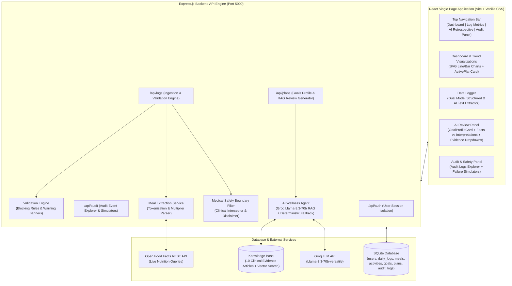

# 🩺 Longitudinal Health & Nutrition Review Agent

A full-stack, stateful AI-powered wellness application built to track daily health metrics, detect data anomalies, extract nutrition from natural language text via live REST APIs, perform evidence-backed RAG retrospectives using Groq LLM (`llama-3.3-70b-versatile`), and manage versioned health goals (`v1` → `v2`) with human-in-the-loop approval panels.

---

## 📐 Architecture Overview



---

## 🌟 Key Features & Scope

### 1. Completed Scope
* **User Profile & Multi-User Isolation**: User signup/login with Date of Birth and Sex collection, salted password hashing, and complete data isolation in SQLite.
* **Dual-Mode Data Logger**: Structured inputs for weight, height, sleep, mood, energy, workouts, and natural text meal parsing (*"Had 2 Rotis with Dal Makhani"*) via live Open Food Facts REST API with quantity multipliers (`2x Rotis`).
* **Interactive AI Meal Estimate Override**: Editable grid to adjust calories/macros before saving, logging `UserCorrection` and `AIUncertainty` audit events.
* **Deterministic Summaries & SVG Trend Charts**: 7-day and 30-day aggregates for weight, sleep, calories, and workouts visualized via zero-dependency responsive SVG Line & Bar charts with hover tooltips. Empty state hides charts when 0 logs exist.
* **Data Integrity Engine & Inconsistency Rules**:
  * 🛑 **Blocking Rules**: Sleep < 3h & Energy ≥ 9 paradox; Activity > 120m & Calories < 1000 kcal extreme deficit.
  * ⚠️ **Non-Blocking Warnings**: 24h weight jump (+3kg) and calorie vs weight loss contrast.
  * ℹ️ **Gap Scanner**: Past 7-day missing log entry detector.
* **Versioned Goals & Active Plans (`v1` → `v2`)**: Active Goals Profile supporting multiple target activities (*Running, Walking, Cycling*) with version preservation. Unconfigured by default for brand new users.
* **AI Wellness Agent & RAG Pipeline**:
  * Powered by Groq API (`llama-3.3-70b-versatile`) with JSON mode and deterministic fallback engine.
  * Hybrid Vector Search: Dense Cosine Similarity + Sparse BM25 Okapi + Reciprocal Rank Fusion (RRF).
  * Clinical Evidence: 10 GRADE A/B articles with DOIs and MeSH ontology tags.
  * **Facts vs. Interpretations Separator**: Visual cyan (Facts) vs purple (Interpretations) panels.
  * **Editable Retrospective**: Editable narrative textarea before approval.
  * **Human-in-the-Loop Approval**: Explicit Approve & Apply vs Decline modal with required rejection reasons.
* **Medical Safety Boundaries & Audit Control Panel**:
  * Intercepts clinical queries (*prescriptions, diagnosis, dosages*) with HTTP 400 & mandatory disclaimer.
  * Audit logs explorer displaying `UserCorrection`, `AIUncertainty`, `PlanModification`, `RejectedRecommendation`, `MedicalSafetyBypass`, and `WorkflowFailure` events.
  * Failure simulators for **504 Gateway Timeout** and **503 Service Unavailable**.

---

### 🚫 Intentionally Excluded Scope
The following features were intentionally excluded from the current scope to focus on core agentic review workflow quality, data integrity, and deterministic reliability:
* **Clinical Diagnosis & Medication Prescriptions**: Out of scope due to safety boundaries; the agent is strictly a wellness & lifestyle review tool.
* **Real-time WebSockets / Push Notifications**: Retrospective reviews are generated on-demand rather than streaming real-time alerts.
* **Direct Hardware Wearable Integrations**: (e.g. Apple HealthKit / Fitbit OAuth APIs) Data entry is performed via structured forms and AI text parsing.
* **Multi-tenant Cloud Database Clusters**: SQLite was chosen for zero-dependency local data persistence and deterministic test reproducibility.

---

## ⚠️ Known Limitations

1. **SQLite Single-Writer Concurrency**: SQLite operates with file-level locking during write transactions. While perfect for single-server instances and MVPs, high-concurrency multi-region deployments require migrating to PostgreSQL.
2. **Password Hashing**: Passwords use SHA-256 string hashing for demonstration simplicity; production deployments should upgrade to `bcrypt` or `argon2` with salt rounds.
3. **External REST API Latency**: The Open Food Facts API is queried with an `AbortController` 1.5-second timeout. If the external network times out, the system seamlessly falls back to local nutritional maps.

---

## 🚀 Quick Start & Installation

### Prerequisites
* **Node.js**: v18.0.0 or higher
* **npm**: v9.0.0 or higher

### Setup Steps

1. **Clone the Repository**:
   ```bash
   git clone https://github.com/Jayasuryanarayana007/Longitudinal-Health-and-Nutrition-Review-Agent.git
   cd "Longitudinal Health and Nutrition Review Agent"
   ```

2. **Install Dependencies**:
   ```bash
   npm run install:all
   ```

3. **Configure Environment Variables**:
   Copy `.env.example` to `.env`:
   ```bash
   cp .env.example .env
   ```
   Add your Groq API Key to `.env` (optional — if omitted, local deterministic RAG fallback engages automatically):
   ```env
   GROQ_API_KEY=your_groq_api_key_here
   PORT=5000
   NODE_ENV=development
   ```

4. **Launch Application in Development Mode**:
   ```bash
   npm run dev
   ```
   * **Frontend**: Open `http://localhost:5173/` in your browser.
   * **Backend API**: Listening at `http://localhost:5000/`.

---

## 🌐 Production Deployment Guide

### Production Build & Launch
To test production mode locally:
```bash
npm run build
npm start
```
The Express server automatically serves the static production SPA bundle from `client/dist`.

### Deployment to Render.com / Railway / Fly.io

1. **Web Service Setup**: Connect repository to Render.com or Railway.
2. **Build & Start Commands**:
   * **Build Command**: `npm run build`
   * **Start Command**: `npm start`
3. **Environment Variables**:
   * `GROQ_API_KEY`: Your Groq API Key
   * `NODE_ENV`: `production`
   * `PORT`: `10000` (or platform default)
4. **Persistent Disk Volume (Crucial for SQLite Data Persistence)**:
   * Mount a persistent disk volume to `/server/data` so `database.sqlite` persists across container restarts.

---

## 🧪 Running Automated Testing Suites

Execute the master breakage runner to verify all 7 test modules (64 test cases):

```bash
node scratch/master_breakage_check.mjs
```

### Individual Test Suites
* Core Auth & API Suite: `node scratch/api_tests.mjs`
* V3 Validation Engine Suite: `node scratch/v3_extensive_tests.mjs`
* V4 Text Extractor Suite: `node scratch/v4_tests.mjs`
* V4 Edge-Case Breakage Suite: `node scratch/v4_breakage_check.mjs`
* V5 RAG & Goals Suite: `node scratch/v5_tests.mjs`
* V5 Edge-Case Suite: `node scratch/v5_breakage_check.mjs`
* V6 Medical Safety & Failure Suite: `node scratch/v6_tests.mjs`
* End-to-End Workflow Verification: `node scratch/e2e_full_workflow_test.mjs`
* Edge Cases (0 logs / 0 goals) Verification: `node scratch/edge_cases_test.mjs`

---

## 📂 Project Directory Structure

```
.
├── client/                      # React Frontend App (Vite + Vanilla CSS)
│   ├── src/
│   │   ├── components/
│   │   │   ├── AIReviewPanel.jsx     # AI Retrospective, RAG Review & Plan Approval Panel
│   │   │   ├── ActivePlanCard.jsx    # Today's Active Approved Protocol Summary
│   │   │   ├── AuditDashboard.jsx   # Audit Logs Explorer & API Failure Simulators Panel
│   │   │   ├── Auth.jsx             # Signup / Login Screens
│   │   │   ├── Dashboard.jsx        # Summaries, SVG Trend Charts & Gap Scanner Banner
│   │   │   ├── DataLogger.jsx       # Dual Input Mode (Structured & AI Text Extractor)
│   │   │   ├── GoalProfileCard.jsx  # Active Goals Profile & Multiple Target Activities
│   │   │   └── TrendCharts.jsx      # Zero-Dependency SVG Line & Bar Charts
│   │   ├── App.jsx                  # Top Navigation Bar & Workspace Router
│   │   ├── index.css                # Glassmorphic Dark-Theme Styling System
│   │   └── main.jsx
│   └── vite.config.js
│
├── server/                      # Express Backend API Engine
│   ├── data/
│   │   ├── db.js                    # SQLite Database Connection & Schema Migrations
│   │   └── knowledgeBase.js         # 10 Curated Clinical Evidence Articles
│   ├── routes/
│   │   ├── audit.js                 # Audit logs explorer & failure simulation endpoints
│   │   ├── auth.js                  # User registration & session management
│   │   ├── logs.js                  # Daily metrics logger & text meal extraction endpoints
│   │   └── plans.js                 # Goals CRUD, RAG review generator & plan approvals
│   ├── services/
│   │   ├── aiWellnessAgent.js       # RAG retrieval, Facts vs Interpretations, Groq LLM API
│   │   ├── foodApiService.js        # Open Food Facts REST API service with timeout signals
│   │   ├── groqService.js           # Groq API client (llama-3.3-70b-versatile)
│   │   ├── mealExtractionService.js # Text tokenizer & quantity multiplier parser
│   │   └── vectorSearchService.js   # Cosine Vector Similarity + BM25 + Reciprocal Rank Fusion
│   ├── utils/
│   │   ├── hash.js                  # Password hashing
│   │   ├── medicalSafetyFilter.js   # Clinical query scanner & disclaimer interceptor
│   │   └── validationEngine.js      # Range checks, blocking rules & gap scanner
│   └── index.js                     # Main Express server entry point
│
├── scratch/                     # Automated Test Suites (64 test cases)
├── .env.example                 # Environment variable configuration template
├── package.json                 # Root dependencies & build/start scripts
└── README.md                    # System documentation
```

---

## 📜 License & Compliance

* **License**: MIT License
* **Medical Safety Notice**: This application is strictly an AI Wellness & Lifestyle Review Agent designed for personal tracking and informational self-review. It does not provide clinical diagnoses, prescriptions, or medical treatment advice.
